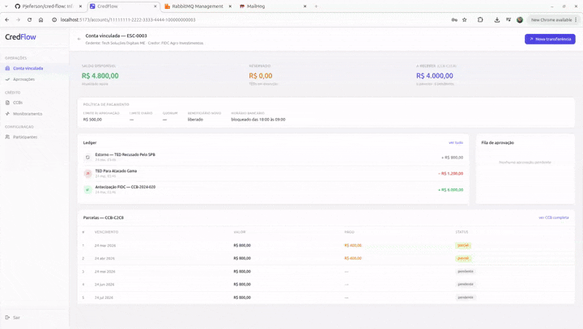
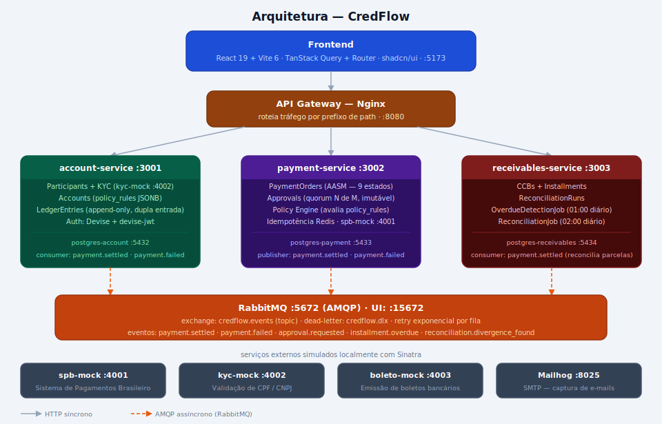
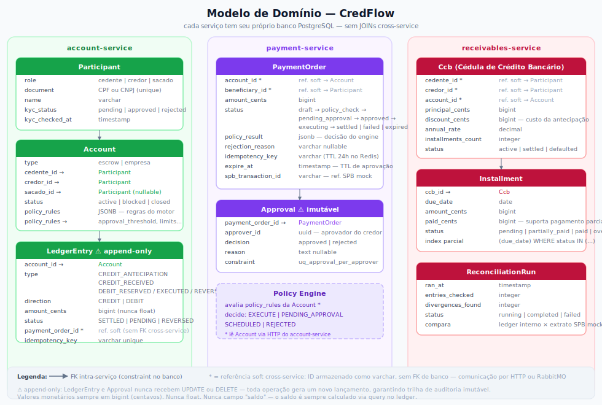

# CredFlow

Infraestrutura de crédito e pagamentos implementada do zero — conta vinculada com permissionamento tripartite, motor de aprovação configurável por regras, gestão de recebíveis e conciliação financeira.

O projeto simula o back-office de uma plataforma de crédito: credores (FIDCs, securitizadoras) que operam contas vinculadas com governança real sobre as saídas, cedentes que antecipam recebíveis, e sacados que pagam parcelas de CCBs. Todo o ambiente roda localmente sem dependências externas — serviços mock substituem o SPB, KYC e emissão de boletos.

---

## Demonstração em vídeo



▶ Walkthrough completo no YouTube — clique na thumbnail abaixo para assistir:

[](https://youtu.be/Hjy_7py_ByY)

---

## O que está implementado

### Conta vinculada (escrow)
Conta bancária com três partes permissionadas: o cedente é o titular, o credor controla as saídas acima do limite, o sacado paga os boletos. O saldo nunca é um campo no banco — é calculado a partir de um ledger imutável de dupla entrada. Qualquer tentativa de débito passa por reserva prévia; se a liquidação falhar, a reserva é revertida automaticamente pelo consumer `payment.failed`.

### Motor de aprovação com dupla alçada
Toda ordem de pagamento passa por um policy engine antes de ser executada. As regras são configuradas por conta (em JSONB) e avaliadas em sequência: valor acima do limite exige aprovação de N de M aprovadores do credor, horário fora da janela bancária agenda o pagamento para o próximo dia útil, beneficiário novo dispara revisão obrigatória, limite diário excedido rejeita com motivo registrado. Pagamentos em aprovação têm TTL — se o quorum não for atingido no prazo, o sistema compensa automaticamente via `ExpirePendingApprovalsJob`.

### Gestão de recebíveis (CCB)
A emissão de uma CCB gera todo o cronograma de parcelas em uma única transação atômica. Um job diário detecta inadimplência e calcula juros de mora sobre o saldo devedor (não sobre o valor cheio). Suporte a pagamento parcial de parcela.

### Conciliação financeira
Job noturno que compara cada lançamento do ledger interno com o que o SPB mock reporta como efetivamente liquidado. Divergências são registradas com valor esperado, valor recebido e diferença — prontas para investigação.

### Notificações
Consumers RabbitMQ enviam e-mails via Mailhog quando uma aprovação é solicitada (com lista de aprovadores) e quando um pagamento falha (notificação ao cedente).

---

## Arquitetura

Três serviços Rails independentes, cada um com seu próprio banco PostgreSQL. Comunicação síncrona via HTTP para leitura, assíncrona via RabbitMQ para mudança de estado. Um Nginx roteia o tráfego por prefixo de path — o frontend fala apenas com `localhost:8080`.



**Fluxo de uma operação ponta a ponta:**

```
1.  Participantes criados (cedente, credor, sacado) + KYC aprovado
2.  Conta vinculada aberta com policy_rules configuradas pelo credor
3.  CCB emitida → installments geradas automaticamente
4.  Credor deposita valor antecipado → CREDIT_ANTECIPATION no ledger
5.  Sacado paga boletos mensais → CREDIT_RECEIVED por parcela
6.  Cedente solicita TED de saída
7.  Policy engine avalia → PENDING_APPROVAL (valor > limite)
8.  Aprovadores do credor recebem e-mail (Mailhog) com link
9.  2 de 3 aprovadores assinam → payment_order vai para APPROVED
10. SPB mock executa → DEBIT_RESERVED → DEBIT_EXECUTED
11. Evento payment.settled → ledger confirma via consumer
12. Job 01:00 detecta inadimplência em parcelas vencidas
13. Job 02:00 concilia ledger com extrato SPB mock
```

---

## Modelo de domínio

Três serviços, cada um responsável por um bounded context distinto. Sem JOINs cross-service — comunicação por HTTP (leitura) ou eventos RabbitMQ (mudança de estado).



**account-service** centraliza identidade e dinheiro: quem são os participantes, quais contas existem e todo o histórico de movimentações no ledger. É o único serviço que sabe o saldo real de uma conta.

**payment-service** orquestra a intenção de pagamento: cria a ordem, submete ao policy engine, coleta aprovações e aciona o SPB mock. Não grava dinheiro — publica eventos para o account-service fazer os lançamentos no ledger.

**receivables-service** gerencia o lado do crédito: emite CCBs, controla o ciclo de vida das parcelas e reconcilia o que o ledger registrou com o que o SPB mock efetivamente liquidou.

Duas invariantes de design visíveis no diagrama: `LedgerEntry` e `Approval` são **append-only** — nenhuma operação faz `UPDATE` ou `DELETE` nessas tabelas. Toda a trilha de auditoria está preservada por construção. Valores monetários são sempre `bigint` em centavos — nunca `float`.

---

## Mocks — sem dependências externas

Todos os serviços externos são substituídos por implementações Sinatra que reproduzem o comportamento real:

| Mock | O que simula | Detalhe |
|---|---|---|
| `spb-mock` | Sistema de Pagamentos Brasileiro | Liquidação com delay configurável, cenários de timeout e falha por rota |
| `kyc-mock` | Validação de identidade (CPF/CNPJ) | Aprovação ou recusa baseada em regras por documento |
| `boleto-mock` | Emissão de boletos bancários | Gera linha digitável com dígitos verificadores válidos |
| `mailhog` | SMTP | Captura e-mails de notificação — interface em `localhost:8025` |

Implementar os mocks como serviços reais (e não stubs de teste) demonstra o protocolo de integração, não apenas que o código chama uma URL.

---

## Stack

| Camada | Tecnologia |
|---|---|
| Backend | Ruby 3.4 · Rails 8.1 API-only |
| Autenticação | Devise + devise-jwt |
| Banco de dados | PostgreSQL 17 (instância isolada por serviço) |
| Cache / Idempotência | Redis 7 |
| Mensageria | RabbitMQ 3 · Bunny (publisher) · Sneakers (consumer) |
| Jobs assíncronos | Solid Queue |
| State machine | AASM |
| Mocks | Sinatra |
| Frontend | React 19 · Vite 6 · TanStack Query · TanStack Router |
| UI | shadcn/ui · Tailwind CSS |
| Testes backend | RSpec · FactoryBot |
| Testes frontend | Vitest · Testing Library · MSW · Playwright |
| Infra local | Docker Compose |

---

## Rodando localmente

**Pré-requisito:** Docker e Docker Compose instalados.

```bash
git clone https://github.com/pjeferson/credflow
cd credflow
docker compose up
```

Aguarde todos os serviços subirem (~30s na primeira vez). Em seguida, em outro terminal:

```bash
# Migrar os bancos
docker compose run --rm account-service bundle exec rails db:migrate
docker compose run --rm payment-service bundle exec rails db:migrate
docker compose run --rm receivables-service bundle exec rails db:migrate

# Popular com dados de exemplo
docker compose run --rm account-service bundle exec rails db:seed
```

| Interface | URL |
|---|---|
| Frontend | http://localhost:5173 |
| API Gateway | http://localhost:8080 |
| RabbitMQ UI | http://localhost:15672 |
| Mailhog | http://localhost:8025 |
| SPB mock | http://localhost:4001 |

---

## Conceitos financeiros implementados

Para quem não é familiar com o domínio:

- **Conta vinculada (escrow)** — conta bancária onde os recursos ficam sob controle compartilhado entre as partes de uma operação de crédito. O titular pode solicitar saídas, mas o credor precisa aprovar as acima do limite.

- **CCB (Cédula de Crédito Bancário)** — instrumento jurídico que formaliza uma operação de crédito, com valor, taxa de juros e cronograma de parcelas.

- **Antecipação de recebíveis** — uma empresa que tem R$ 2M a receber em 12 meses "vende" esses recebíveis para um fundo (com desconto) e recebe o dinheiro agora. O fundo recebe as parcelas diretamente.

- **Dupla alçada** — controle de governança onde pagamentos acima de certo valor precisam de mais de um aprovador. Comum em tesouraria corporativa para reduzir risco de fraude interna.

- **Ledger de dupla entrada** — forma contábil de registrar movimentações: cada evento tem dois lados (débito e crédito). O saldo é sempre calculado, nunca armazenado — impossível de adulterar sem deixar rastro.

---

## Estrutura do repositório

```
credflow/
├── services/
│   ├── account-service/      # participantes, contas, ledger
│   ├── payment-service/      # ordens de pagamento, motor de aprovação
│   └── receivables-service/  # CCBs, parcelas, conciliação
├── frontend/                 # SPA React
├── mocks/
│   ├── spb-mock/             # Sinatra — simula liquidação TED/Pix
│   ├── kyc-mock/             # Sinatra — valida CPF/CNPJ
│   └── boleto-mock/          # Sinatra — gera linha digitável
├── assets/                   # diagramas SVG
├── api-gateway/              # configuração Nginx
├── docs/                     # modelo de dados, domínio, eventos RabbitMQ
└── docker-compose.yml
```
